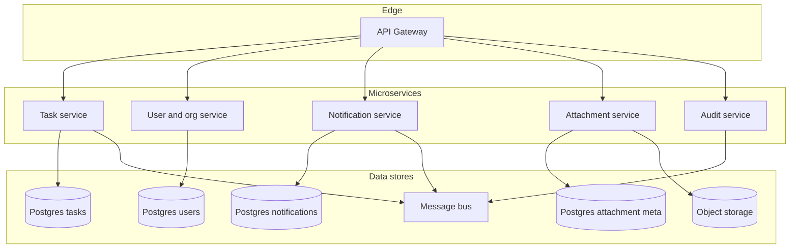
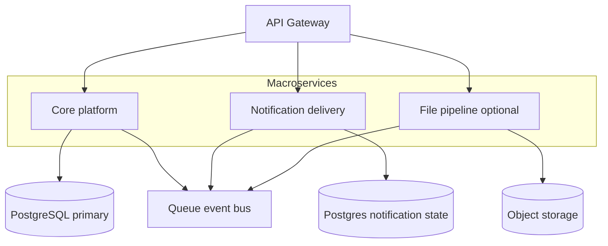
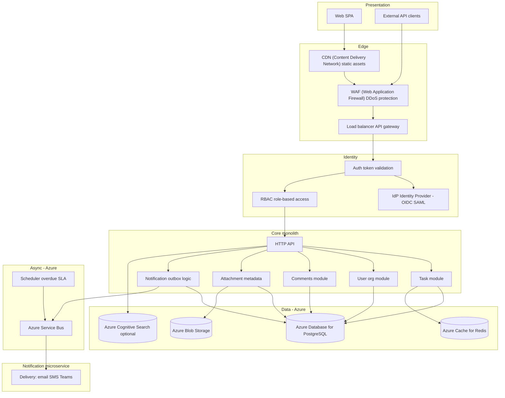

# Deliverable 1: Solution Architecture

**System:** Task Management System for internal and external users — create, assign, and track tasks; comments and file attachments; authentication and authorization; integration API; web UI; notifications (e.g. new assignment, overdue, status changes); cloud-ready, scalable, secure.

**Context:** Enterprise deployment; the system **starts** serving approximately **1,000** users and **grows slowly** over time toward **3,000–10,000** users; **task volume** accumulates (historical tasks, comments, attachments, audit events). **Cloud platform:** Azure-only (no AWS, Google Cloud, or other providers).

---

## 1. Architectural options: Microservices, Macroservices, and Monolith

This section compares **three** placements on the spectrum from **one deployable** to **many small services**, then states the **recommended** option for this product and scale.

**Spectrum (coarse → fine decomposition):**

`Monolith` ←—— **Macroservices** ——→ `Microservices`

**Key acronyms used in this document (defined at first use):**
- **ACID** — Atomicity (all-or-nothing), Consistency (data validity), Isolation (no interference between concurrent transactions), Durability (committed data survives crashes)
- **API** — Application Programming Interface | **RBAC** — role-based access control | **OIDC** — OpenID Connect | **SAML** — Security Assertion Markup Language
- **CDN** — Content Delivery Network | **WAF** — Web Application Firewall | **DDoS** — Distributed Denial of Service | **TLS** — Transport Layer Security
- **JWT** — JSON Web Token | **DLQ** — dead-letter queue | **SLO** — service level objective | **SLA** — service level agreement
- **SPA** — single-page application | **IAM** — Identity and Access Management | **CI/CD** — Continuous Integration / Continuous Deployment | **IdP** — Identity Provider

---

### 1.1 Option A — Microservices

**Idea:** Split the domain into **several independently deployed services**, each with its own lifecycle, and often **database-per-service**. Example decomposition:

- **Task service** — task lifecycle, assignment, status, comments (or comments as separate service).
- **User / organization service** — identities, tenants, membership, RBAC (role-based access control) data.
- **Notification service** — preferences, templates, delivery orchestration.
- **Attachment service** — metadata, presigned URLs, scan workflow.
- **Audit / compliance service** (optional separate) — append-only audit API.
- **API gateway** — routing, auth validation, rate limits; clients talk only to the gateway.

**Diagram (text — visible in any editor, PDF, and Word):**

```text
                         +---------------+
                         |  API Gateway  |
                         +-------+-------+
                                 |
     +------------+---------------+---------------+------------+
     |            |               |               |            |
     v            v               v               v            v
+---------+ +-----------+ +---------------+ +-----------+ +---------+
|  Task   | | User/Org  | | Notification  | | Attachment| |  Audit  |
| service | |  service  | |   service     | |  service  | | service |
+----+----+ +-----+-----+ +-------+-------+ +-----+-----+ +----+----+
     |            |               |               |            |
     v            v               v               v            v
 PG_tasks    PG_users        PG_notif       PG_files      (append)
                                                    |            |
                                                    v            v
                                              Object        Message
                                              storage          bus
     Task, Notification, Attachment, Audit also publish or consume events via the message bus.
```

**Same figure (Mermaid — renders on GitHub and in [Mermaid Live Editor](https://mermaid.live); in VS Code/Cursor install a “Mermaid” preview extension if needed):**



**When it shines:** Large engineering organization (many teams), **independent release cadence** per area, need to **scale one hotspot** (e.g. notifications) far beyond the rest, and mature **platform engineering** (service mesh, contract tests, SLOs — service level objectives — per service).

**Costs for this assignment’s context:** Cross-service workflows (assign task → notify → audit) become **sagas or choreography**; **eventual consistency** and duplicate/out-of-order events must be designed; **local transactions** across task + user + comment are **not** available without careful boundaries; operational load (N deployables, N pipelines, distributed tracing as mandatory) is high for this user range unless the org is already staffed for it.

---

### 1.2 Option B — Macroservices

**Idea:** **Fewer, larger** deployables than Microservices — coarser boundaries, **less** network chatter and **fewer** distributed transactions, but **more** isolation than a Monolith. Example:

1. **Core platform service** — tasks, users/orgs, comments, and shared transactional workflows (single primary DB or schema-separated Postgres).
2. **Notification & delivery service** — outbox consumption, email/push/webhooks, schedulers for overdue rules (own DB or shared with clear ownership).
3. **File / attachment pipeline** (optional third deployable) — upload orchestration, malware scan, metadata sync events back to core.

Still uses an **API gateway**, **async messaging** between core and notifications, and clear **contracts** — but **not** one microservice per entity.

**Diagram (text):**

```text
                    +---------------+
                    |  API Gateway  |
                    +-------+-------+
                            |
          +-----------------+-----------------+
          |                 |                 |
          v                 v                 v
   +-------------+   +-------------+   +----------------------+
   |    Core     |   | Notification|   | File and attachment  |
   |  platform   |   |  delivery   |   | pipeline (optional)  |
   | tasks users |   |   service   |   +----------+-----------+
   |  comments   |   +------+------+              |
   +------+------+          |                     v
          |                 |              +---------------+
          v                 v              | Object storage|
   +-------------+   +-------------+      +---------------+
   | PostgreSQL  |   | Postgres or |
   |  primary    |   | notif DB    |
   +------+------+   +------+------+
          |                 |
          +--------+--------+
                   v
            +-------------+
            | Queue/bus   |
            +-------------+
```

**Same figure (Mermaid):**



**When it shines:** You want **some** scaling and failure isolation for **notification spikes** or **file processing** without committing to six+ services; a **small platform team** can operate 2–4 services.

**Tradeoff:** More moving parts than a Monolith; **still** need versioning and idempotent consumers — but **simpler** than Microservices because **core task workflows stay in one place**.

---

### 1.3 Option C — Monolith (+ async workers)

**Idea:** **One** primary application process (or one container image) with **strict internal modules** (tasks, users, comments, attachment metadata, notification outbox). **Spiky/slow work** (delivery, scanning) runs in **separate worker processes** consuming the same logical design as a “hybrid” edge — see **Section 2**.

This is the **Monolith** end of the spectrum: maximum **local consistency** and **simplest deploy**, at the cost of **scaling “all features together”** unless you extract workers or read paths later.

---

### 1.4 Side-by-side comparison

| Dimension | **C: Monolith** (+ workers) | **B: Macroservices** | **A: Microservices** |
|-----------|-------------------------------------|----------------------|-----------------------------------|
| **Deploy / ops complexity** | Lowest | Medium | Highest |
| **ACID across task + user + comment** | Straightforward in one database | Possible if kept in core service | Hard; patterns like saga / eventual consistency |
| **Independent scaling of parts** | Scale whole API + separate workers | Scale notification/file tiers separately | Fine-grained scaling per service |
| **Team fit (small team)** | Strong fit | Workable with discipline | Needs strong platform + multiple teams |
| **Failure isolation** | Blast radius = whole app (mitigated by workers) | Partial isolation | Best *if* resilience patterns mature |
| **Contract & integration burden** | Internal module APIs | Few external APIs + events | Many APIs, versioning, contract tests |
| **Time to first reliable release** | Fastest | Medium | Slowest without existing platform |
| **Fit for 1k users growing to 3k–10k** | **Strong** with horizontal replicas, database tuning, queue | **Strong** if notification/file isolation is a priority | **Often overspecified** unless org/scale demands it |

*ACID = Atomicity (all-or-nothing), Consistency (data validity), Isolation (no interference between concurrent transactions), Durability (committed data survives crashes).*

---

### 1.5 Decision: **best option for this system — Option B (core monolith + Notification microservice)**

**Chosen approach:** **Option B (macroservices)** — a **core platform monolith** (tasks, users, comments, attachments, notification *logic* and outbox) with a **single shared database (PostgreSQL)**, plus a **dedicated Notification microservice** that handles all delivery (email, SMS, Microsoft Teams, and other channels). The two communicate asynchronously via a **message queue**.

**Why not Option A (Microservices)?**

- User and task scale (starting at ~1k users, growing toward 3k–10k) does not justify splitting tasks, users, and comments into separate services. Core flows (create, assign, comment, audit) **benefit from one transactional boundary** in the shared database.
- Microservices (task service, user service, notification service, attachment service, audit service) multiply **operational load** (operations: deploy, monitor, trace, fix) and **distributed consistency** risk — overkill for this scale without a large platform team.

**Why not Option C (pure Monolith with only in-process workers)?**

- Notifications are a **must-have** and support **multiple channels** (email, SMS, Microsoft Teams, extensible to Slack, push, webhooks). Each provider (e.g. Azure Communication Services, Microsoft Graph for Teams) has its own API, authentication, rate limits, and failure modes.
- Keeping delivery **inside the Monolith** — even as separate worker processes — couples notification provider changes to the core release cycle and limits **independent scaling** when notification volume spikes (e.g. bulk assignments, outage alerts).
- A **dedicated Notification microservice** isolates these integrations and gives clear ownership for adding new channels without touching the core.

**Why Option B with a Notification microservice is the best fit:**

1. **Integration complexity:** Email and SMS (Azure Communication Services), Microsoft Teams (Microsoft Graph API, webhooks), and future channels (Slack, push) each have different APIs, authentication, retries, and rate limits. One service owns all of that logic.
2. **Extensibility:** Slack, in-app push, webhooks, etc. can be added without touching the core Monolith or its database schema.
3. **Scaling:** Notification volume can spike independently of API traffic (e.g. bulk assign 500 tasks). A separate service scales on its own.
4. **Stability:** If a provider (e.g. Azure Communication Services, Teams API) is slow or down, only the Notification service is impacted; the core API, task creation, and assignment stay healthy.

**Summary for reviewers:** *We recommend **Option B**: a **core monolith** for domain logic and a **shared database**, plus a **Notification microservice** for delivery. The core publishes notification intents to a queue; the Notification service consumes and delivers via email, SMS, Teams, and other providers. This balances **transactional simplicity** in the core with **isolation** and **extensibility** where notifications matter most.*

**Evolution path:** The system **starts** at ~1k users and grows slowly. For the initial deployment, a **Monolith** (Option C) with async workers is acceptable — simpler to operate and lower cost. Plan to extract the **Notification microservice** (move to Option B) when approaching 2–3k users or when notification spikes (e.g. bulk assignments) begin to affect the core API.

```text
  Phase 1 (~1k users)              Phase 2 (~2–3k+ users)
  Monolith (Option C)       →      Macroservices (Option B)
  ┌─────────────────────┐         ┌─────────────┐   ┌─────────────────┐
  │ Core + async workers │         │ Core monolith│   │ Notification    │
  │ (single App Service) │   →     │ + shared DB  │   │ microservice    │
  │                     │         │              │   │ (separate scale)│
  └─────────────────────┘         └─────────────┘   └─────────────────┘
  Trigger: notification spikes, bulk assignments, or ops need for isolation
```

---

## 2. High-level architecture diagram (recommended: Option B — core monolith + Notification microservice)

Section 1 compared **Microservices**, **Macroservices**, and **Monolith**. The diagrams below reflect the **chosen** design: **Option B** — a **core platform monolith** with shared database, plus a **dedicated Notification microservice** that consumes from a queue and delivers via email, SMS, Microsoft Teams, and other channels.

**Viewing diagrams:** Plain **text** figures render everywhere. **Mermaid** blocks render on **GitHub** when you push the repo; for local preview use **[mermaid.live](https://mermaid.live)** or a Markdown preview extension that enables Mermaid.

### 2.1 End-to-end view (components and technology anchors)

This diagram shows **layers** (clients, edge, identity, application, async, data), the **core monolith** as the main application tier, the **Notification microservice** as a separate deployable, and **major technology choices** (relational database, cache, object storage, queue).

**Diagram (text):**

```text
  +------------------+          +---------------------------+
  |     Web SPA      |          | External API integrators  |
  +--------+---------+          +-------------+-------------+
           |                                    |
           v                                    v
  +--------+------------------------------------+---------+
  | CDN (Content Delivery Network) -> WAF (Web App Firewall) -> Load balancer / API gateway |
  +---------------------------+---------------------------+
                              |
                              v
  +---------------------------+---------------------------+
  | Identity: IdP (Identity Provider) OIDC/SAML  Auth  RBAC policy       |
  +---------------------------+---------------------------+
                              |
          +-------------------+-------------------+
          |                                     |
          v                                     v
  +=======================+          +---------------------------+
  |   Core monolith       |          |  Notification microservice |
  |   HTTP API (REST)     |          |  email, SMS, Teams, etc.   |
  |  Tasks Users Comments |          +-------------+---------------+
  |  Attach metadata      |                        |
  |  Notif outbox (logic) |                        |
  +-----------+-----------+                        |
          |               |                        |
          v               v                        v
  +-------+-------+  +----+----+              +---------+
  | Azure DB for  |  | Azure  |<-------------+ consume |
  | PostgreSQL    |  |ServiceBus|               | deliver |
  +-------+-------+       ^                   +---------+
          |               |
          v               +------------------+
   +-------------------+  | Scheduler        |
   | Azure Cache for   |  | overdue, SLA     |
   | Redis, Azure Blob |  +------------------+
   +-------------------+

  Core monolith publishes notification intents to queue. Notification microservice
  consumes and delivers via email and SMS (Azure Communication Services), Microsoft Teams (Microsoft Graph), etc.

  Optional: Azure Cognitive Search for dashboard or full-text search.
```

**Same figure (Mermaid):**



### 2.2 Logical layering (summary)

| Layer | Responsibility |
|-------|----------------|
| **Presentation** | Web SPA; external clients consuming the public API. |
| **Edge** | TLS (Transport Layer Security) termination, routing, throttling, static asset delivery. |
| **Identity** | Authenticate users and machines; enforce RBAC (role-based access control) and resource policies on each request. |
| **Application** | Core monolith: domain logic (tasks, users, comments, attachments, notification outbox); Notification microservice: delivery via email, SMS, Teams, and other channels. |
| **Async** | Message queue; scheduler for overdue and SLA (service level agreement) rules; core publishes notification intents; Notification service consumes and delivers. |
| **Data** | Event store + projections (PostgreSQL); cache (Azure Cache for Redis); blobs (Azure Blob Storage); optional search (Azure Cognitive Search). |

---

## 3. Key technology choices

| Concern | Choice | Rationale |
|---------|--------|-----------|
| **Core transactional data** | **Azure Database for PostgreSQL** | Event store (append-only task events) + projections (tasks, comments); strong consistency; managed, integrated with Azure Monitor. **Event sourcing** for task state — see Section 3.1. |
| **Attachments** | **Azure Blob Storage** + metadata in PostgreSQL | Keeps the database lean; supports large files, versioning, and lifecycle policies; Azure CDN–friendly for downloads where appropriate. |
| **Session / hot read caching** | **Azure Cache for Redis** | Rate limiting, distributed locks, optional cache for hot entities and permission snapshots. |
| **Async work** | **Azure Service Bus** (message queue) | Decouples API latency from email/push/webhook delivery; retries and DLQs (dead-letter queues: queues for failed messages) for resilience. |
| **API style** | **REST** (Representational State Transfer) or **GraphQL** if the team standardizes on it | REST is straightforward for integrators; GraphQL can reduce chatty UIs — either is acceptable if documented and versioned. |
| **Web UI** | **SPA** (single-page application; e.g. React, Vue, Angular) behind **Azure CDN** | Global users benefit from static asset caching at the edge. |

### 3.1 Event sourcing for task state

**Task tracking** requires a record of every state change. The system uses **event sourcing** for task state:

| Component | Role |
|-----------|------|
| **Event store** | Append-only `task_events` table in PostgreSQL. Each change (status, assignee, priority, title, etc.) is stored as an event: `TaskCreated`, `TaskAssigned`, `StatusChanged`, `TaskCompleted`, etc. |
| **Projection** | `tasks` table holds the current state, derived from events. Updated synchronously when events are appended. Used for fast reads (list, detail). |
| **Write path** | API receives PATCH; appends one or more events to the event store; updates projection; publishes to Service Bus for notifications. No UPDATEs on the event store — append-only. |
| **Read path** | List and detail: read from projection. Full history: replay events or query the event store. |

**Benefits:** Append-only writes scale well with many status changes; every change is captured; supports temporal queries (“what did this task look like at 3pm?”); events can drive notifications and analytics.

**Event types (examples):** `TaskCreated`, `TaskAssigned`, `StatusChanged`, `PriorityChanged`, `TitleChanged`, `DueDateChanged`, `TaskCompleted`, `TaskCancelled`.

---

## 4. Authentication & authorization (design decisions)

### 4.1 Authentication

- **Human users (internal and external):** **Azure AD** (Microsoft Entra ID) as the central IdP (Identity Provider) via **OIDC** (OpenID Connect) or **SAML** (Security Assertion Markup Language). **External users:** use **SSO** (single sign-on) through Azure AD B2B or a federated IdP — no separate credentials; they sign in with their organization’s identity. The application validates **JWT** (JSON Web Token) access tokens or session cookies backed by the IdP on each API call.
- **Machine / integration clients:** **OAuth2 client credentials** or **scoped API keys** (rotatable, auditable), stored hashed, with per-tenant rate limits.
- **Principle:** No custom password storage for enterprise SSO (single sign-on) users unless explicitly required; delegate credential lifecycle to the IdP.

### 4.2 Authorization

- **RBAC** (role-based access control) at organization / workspace level (e.g. admin, member, guest, external collaborator).
- **Resource-scoped policies** for tasks: assignee, creator, watchers, team membership, and “external user limited to assigned tasks” patterns.
- **Enforcement:** Central policy check in the API layer using attributes from the token + database membership; **deny by default**.

### 4.3 Internal vs external users

- **External users:** authorized via **SSO** (single sign-on) — Azure AD B2B guest users or federated partners sign in with their organization’s identity; no app-specific passwords.
- Same codebase and API surface; **tenant and role** distinguish capabilities (e.g. external users may not create org-wide reports).
- **Audit** all sensitive actions (assignment changes, permission changes, downloads) for compliance.

---

## 5. Scalability (enterprise users and task volume)

### 5.1 Enterprise context

This architecture targets **enterprise deployment**: the system **starts** at ~**1,000** users and **grows slowly** toward **3,000–10,000**; **task volume** accumulates over time (historical tasks, comments, attachments, notifications). The design supports **multi-tenancy**, **compliance** (audit trails, access control), and **24/7 operation**. The scaling choices below assume this growth path.

### 5.2 Assumptions

- Thousands of concurrent sessions at peak; **task and event data grow without bound** (history, comments, attachments, notifications).
- Read-heavy patterns: task lists, dashboards, search; write spikes: bulk assignment, status updates, comment threads.

### 5.3 Scaling strategy

| Mechanism | Use |
|-----------|-----|
| **Stateless API tier** | Scale **horizontal replicas** behind the load balancer; no session affinity required if auth is token-based. |
| **Database** | Vertical scale first; add **read replicas** for reporting and heavy list queries; **connection pooling** (e.g. PgBouncer or Azure Database for PostgreSQL built-in pooler). |
| **Partitioning / archival** | Plan **time-based partitioning** for the event store and archival for notification history if tables grow very large. |
| **Caching** | Redis for hot keys (task detail, permission summaries) with explicit invalidation on writes. |
| **Async pipeline** | Core monolith publishes events; **Notification microservice** consumes and scales independently to handle delivery fan-out (email, SMS, Teams). |
| **Object storage** | Naturally scalable; uploads/downloads can use **presigned URLs** to offload bandwidth from app servers. |

### 5.4 Resilience

- **Idempotent** notification consumers in the Notification microservice; **dead-letter queues** (DLQ: queues for failed messages) for poison messages.
- **Timeouts and bulkheads** between API and slow dependencies (search, third-party email).

---

## 6. Observability

| Pillar | Practice |
|--------|----------|
| **Logging** | **Structured JSON** logs with **correlation IDs** (request ID, user ID, tenant ID); central aggregation in **Azure Monitor** and **Log Analytics**. |
| **Metrics** | **RED** (rate, errors, duration) for APIs; **USE** (utilization, saturation, errors) for datastores where applicable; business metrics (tasks created, notifications sent, queue depth, overdue counts). |
| **Tracing** | **Distributed tracing** (OpenTelemetry) from edge through API, Notification microservice, and queue — correlates requests across the core monolith and Notification service. |
| **Dashboards & alerts** | SLO (service level objective) oriented dashboards; alerts on error rate, latency, database connections, queue backlog, failed notification rate. **Example SLO:** p95 latency < 500ms for task API; error rate < 0.1%. |
| **Audit trail** | Event store provides immutable task history; additional append-only **audit events** in PostgreSQL for security and compliance (who changed what, when). |

---

## 7. Feature mapping (comments, attachments, notifications)

| Feature | Architectural approach |
|---------|-------------------------|
| **Task state and tracking** | **Event sourcing** — append-only event store; projection for current state; every status/assignee/priority change is an event. Supports full history and temporal queries. |
| **Comments** | Stored relationally with task FK (foreign key); real-time optional via WebSockets or polling; notification on @mention if product requires it. |
| **File upload** | Client uploads to **presigned URL** to object storage; API persists **metadata** (size, MIME, checksum, scan status) in PostgreSQL; optional **malware scanning** in async worker. |
| **New task assigned** | `TaskAssigned` event appended; projection updated; event published to **queue** → **Notification microservice** consumes and delivers via email, SMS, Teams, etc. |
| **Overdue / stale / status change** | **Scheduler** evaluates rules; emits events to queue; **Notification microservice** delivers. Status changes flow through event store and projection. |

---

## 8. Security highlights (cloud-ready)

- **TLS** (Transport Layer Security) everywhere; **encryption at rest** for Azure Database for PostgreSQL and Azure Blob Storage.
- **Least privilege** **Azure RBAC** (role-based access control) and managed identities for application, workers, and CI/CD (Continuous Integration / Continuous Deployment).
- **Input validation**, **output encoding**, upload **size and type** allowlists.
- **Secrets** in managed secret stores, not in code or images.

---

## 9. Conclusion

After comparing **Microservices**, **Macroservices**, and **Monolith**, the **recommended** architecture is **Option B**: a **core monolith** (tasks, users, comments, attachments, notification logic) with a **shared PostgreSQL** database, plus a **Notification microservice** that consumes from **Azure Service Bus** and delivers via **Azure Communication Services** (email, SMS), **Microsoft Teams**, and other channels. The platform is **Azure-native**: Azure Blob Storage for attachments, Azure Monitor and Log Analytics for observability. **External users** are authorized via **SSO** (single sign-on) through Azure AD B2B or federated IdPs. **OIDC/SAML**, **RBAC** (role-based access control) plus resource policies, and structured logging, metrics, and tracing address authentication, scale, and observability for a user base that starts at ~1k and grows toward 3k–10k, with a growing task corpus.

