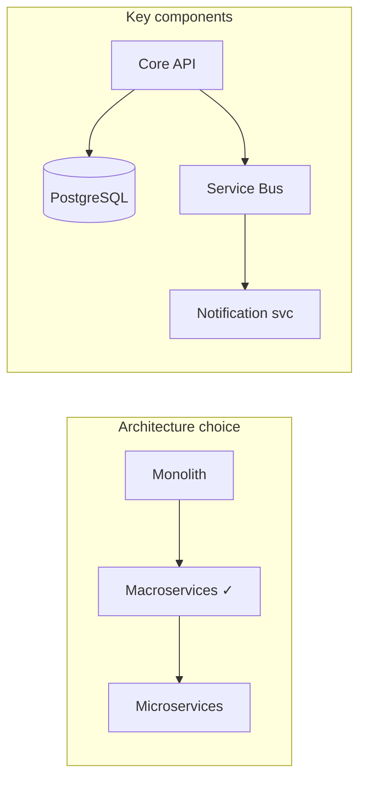
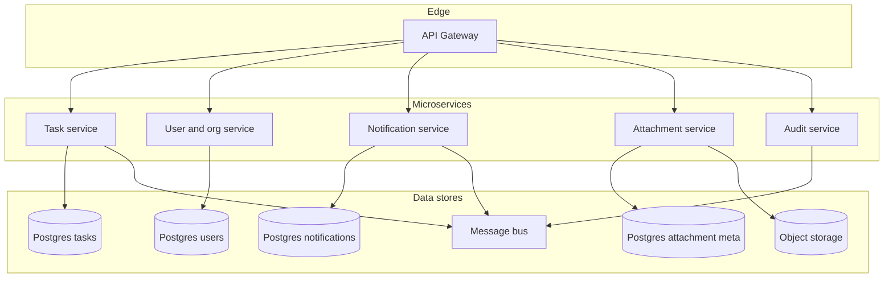
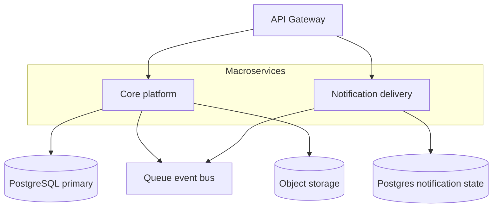
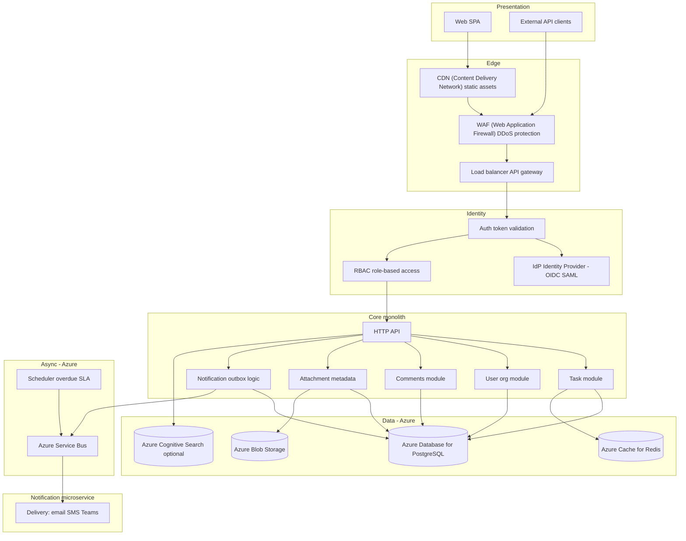

# Deliverable 1: Solution Architecture

**System:** Task Management System for internal and external users — create, assign, and track tasks; comments and file attachments; authentication and authorization; integration API; web UI; notifications (e.g. new assignment, overdue, status changes); cloud-ready, scalable, secure.

**Context:** Enterprise deployment; **task volume** accumulates over time (historical tasks, comments, attachments, audit events). The design supports growth from initial rollout to larger scale. Although the assignment describes a "simple" Task Management System, this design supports both an **MVP path** (relational tasks + audit table, single deployable) and **enterprise evolution** (event sourcing, macroservices, multi-tenancy) as scale and requirements grow. **Cloud platform:** Azure-only (no AWS, Google Cloud, or other providers).

**Scale assumptions:** Designed for **5,000–50,000+ users** and **100K–1M+ tasks** per tenant, with thousands of concurrent sessions at peak. Migrating toward microservices becomes viable when scale, team count, or independent release cadence demand it.

---

## 0. Executive summary (one-page overview)

| Decision | Choice | Rationale |
|----------|--------|-----------|
| **Architecture** | **Option B: Macroservices** (core monolith + Notification microservice) | Balances ACID in core with isolation for notifications; avoids microservices overhead for this scale. |
| **Alternative considered** | Microservices (A) vs Monolith (C) | A: overkill for team size; C: couples notification delivery to core. |
| **Database** | PostgreSQL (event store + projections) | Strong consistency, managed, Azure-integrated. |
| **Async** | Azure Service Bus | Decouples notification delivery; independent scaling. |
| **Identity** | Azure AD (OIDC/SAML), B2B for external users | Enterprise SSO; no custom password storage. |
| **Real-time** | Azure SignalR Service | Per-task group join; instant alerts when others edit. |



---

## 1. Architectural options: Microservices, Macroservices, and Monolith

This section compares **three** placements on the spectrum from **one deployable** to **many small services**, then states the **recommended** option for this product and scale.

**Spectrum (coarse → fine decomposition):**

`Monolith` ←—— **Macroservices** ——→ `Microservices`

**Key acronyms used in this document (defined at first use):**
- **ACID** — Atomicity (all-or-nothing), Consistency (data validity), Isolation (no interference between concurrent transactions), Durability (committed data survives crashes)
- **API** — Application Programming Interface | **RBAC** — role-based access control | **OIDC** — OpenID Connect | **SAML** — Security Assertion Markup Language
- **CDN** — Content Delivery Network | **WAF** — Web Application Firewall | **DDoS** — Distributed Denial of Service | **TLS** — Transport Layer Security
- **JWT** — JSON Web Token | **DLQ** — dead-letter queue | **SLO** — service level objective | **SLA** — service level agreement
- **SPA** — single-page application | **IAM** — Identity and Access Management | **CI/CD** — Continuous Integration / Continuous Deployment | **IdP** — Identity Provider

---

### 1.1 Option A — Microservices

**Idea:** Split the domain into **several independently deployed services**, each with its own lifecycle, and often **database-per-service**. Example decomposition:

- **Task service** — task lifecycle, assignment, status, comments (or comments as separate service).
- **User / organization service** — identities, tenants, membership, RBAC (role-based access control) data.
- **Notification service** — preferences, templates, delivery orchestration.
- **Attachment service** — metadata, presigned URLs, scan workflow.
- **Audit / compliance service** (optional separate) — append-only audit API.
- **API gateway** — routing, auth validation, rate limits; clients talk only to the gateway.

**Diagram (Mermaid — renders on GitHub and in [Mermaid Live Editor](https://mermaid.live); in VS Code/Cursor install a “Mermaid” preview extension if needed):**



**When it shines:** Large engineering organization (many teams), **independent release cadence** per area, need to **scale one hotspot** (e.g. notifications) far beyond the rest, and mature **platform engineering** (service mesh, contract tests, SLOs — service level objectives — per service).

**Costs for this assignment’s context:** Cross-service workflows (assign task → notify → audit) become **sagas or choreography**; **eventual consistency** and duplicate/out-of-order events must be designed; **local transactions** across task + user + comment are **not** available without careful boundaries; operational load (N deployables, N pipelines, distributed tracing as mandatory) is high for this user range unless the org is already staffed for it.

---

### 1.2 Option B — Macroservices

**Idea:** **Fewer, larger** deployables than Microservices — coarser boundaries, **less** network chatter and **fewer** distributed transactions, but **more** isolation than a Monolith. Example:

1. **Core platform service** — tasks, users/orgs, comments, and shared transactional workflows (single primary DB or schema-separated Postgres).
2. **Notification & delivery service** — outbox consumption, email/push/webhooks, schedulers for overdue rules (own DB or shared with clear ownership).
3. **File / attachment pipeline** (optional third deployable) — upload orchestration, malware scan, metadata sync events back to core.

Still uses an **API gateway**, **async messaging** between core and notifications, and clear **contracts** — but **not** one microservice per entity.

**Diagram (Mermaid):**



**When it shines:** You want **some** scaling and failure isolation for **notification spikes** or **file processing** without committing to six+ services; a **small platform team** can operate 2–4 services.

**Tradeoff:** More moving parts than a Monolith; **still** need versioning and idempotent consumers — but **simpler** than Microservices because **core task workflows stay in one place**.

---

### 1.3 Option C — Monolith (+ async workers)

**Idea:** **One** primary application process (or one container image) with **strict internal modules** (tasks, users, comments, attachment metadata, notification outbox). **Spiky/slow work** (delivery, scanning) runs in **separate worker processes** consuming the same logical design as a “hybrid” edge — see **Section 2**.

This is the **Monolith** end of the spectrum: maximum **local consistency** and **simplest deploy**, at the cost of **scaling “all features together”** unless you extract workers or read paths later.

---

### 1.4 Side-by-side comparison

| Dimension | **C: Monolith** (+ workers) | **B: Macroservices** | **A: Microservices** |
|-----------|-------------------------------------|----------------------|-----------------------------------|
| **Deploy / ops complexity** | Lowest | Medium | Highest |
| **ACID across task + user + comment** | Straightforward in one database | Possible if kept in core service | Hard; patterns like saga / eventual consistency |
| **Independent scaling of parts** | Scale whole API + separate workers | Scale notification/file tiers separately | Fine-grained scaling per service |
| **Team fit (small team)** | Strong fit | Workable with discipline | Needs strong platform + multiple teams |
| **Failure isolation** | Blast radius = whole app (mitigated by workers) | Partial isolation | Best *if* resilience patterns mature |
| **Contract & integration burden** | Internal module APIs | Few external APIs + events | Many APIs, versioning, contract tests |
| **Time to first reliable release** | Fastest | Medium | Slowest without existing platform |
| **Fit for typical enterprise growth** | **Strong** with horizontal replicas, database tuning, queue | **Strong** if notification/file isolation is a priority | **Often overspecified** unless org/scale demands it |

*ACID = Atomicity (all-or-nothing), Consistency (data validity), Isolation (no interference between concurrent transactions), Durability (committed data survives crashes).*

---

### 1.5 Decision: **best option for this system — Option B (macroservices with core + Notification)**

**Chosen approach:** **Option B (macroservices)** — a **core platform monolith** (tasks, users, comments, attachments, notification *logic* and outbox) with a **single shared database (PostgreSQL)**, plus a **dedicated Notification microservice** that handles all delivery (email, SMS, Microsoft Teams, and other channels). The two communicate asynchronously via a **message queue**.

**Naming clarity:** Our "Option B" = macroservices pattern with **two deployables initially** (core monolith + Notification service), not six microservices. The optional file/attachment pipeline in Section 1.2 is deferred; we start with core + notifications only.

**Why not Option A (Microservices)?**

- For this product's scope, splitting tasks, users, and comments into separate services adds more cost than benefit. Core flows (create, assign, comment, audit) **benefit from one transactional boundary** in the shared database.
- Microservices (task service, user service, notification service, attachment service, audit service) multiply **operational load** (operations: deploy, monitor, trace, fix) and **distributed consistency** risk — overkill for this scale without a large platform team.

**Why not Option C (pure Monolith with only in-process workers)?**

- Notifications are a **must-have** and support **multiple channels** (email, SMS, Microsoft Teams, extensible to Slack, push, webhooks). Each provider (e.g. Azure Communication Services, Microsoft Graph for Teams) has its own API, authentication, rate limits, and failure modes.
- Keeping delivery **inside the Monolith** — even as separate worker processes — couples notification provider changes to the core release cycle and limits **independent scaling** when notification volume spikes (e.g. bulk assignments, outage alerts).
- A **dedicated Notification microservice** isolates these integrations and gives clear ownership for adding new channels without touching the core.

**Why Option B with a Notification microservice is the best fit:**

1. **Integration complexity:** Email and SMS (Azure Communication Services), Microsoft Teams (Microsoft Graph API, webhooks), and future channels (Slack, push) each have different APIs, authentication, retries, and rate limits. One service owns all of that logic.
2. **Extensibility:** Slack, in-app push, webhooks, etc. can be added without touching the core Monolith or its database schema.
3. **Scaling:** Notification volume can spike independently of API traffic (e.g. bulk assign 500 tasks). A separate service scales on its own.
4. **Stability:** If a provider (e.g. Azure Communication Services, Teams API) is slow or down, only the Notification service is impacted; the core API, task creation, and assignment stay healthy.

**Summary for reviewers:** *We recommend **Option B**: a **core monolith** for domain logic and a **shared database**, plus a **Notification microservice** for delivery. The core publishes notification intents to a queue; the Notification service consumes and delivers via email, SMS, Teams, and other providers. This balances **transactional simplicity** in the core with **isolation** and **extensibility** where notifications matter most.*

**MVP vs target:** The **target steady-state** is core monolith + Notification microservice (two deployables). The **MVP** may run as a single App Service until the queue consumer is extracted in Phase 2 — one deployable for Phase 1, two for Phase 2 onward.

**Evolution path:** The system **starts** with event sourcing in a **monolith** (one deployable), then adds real-time and notifications in **Phase 2**.

```text
  Phase 1 — Event sourcing in monolith     Phase 2 — Add real-time + notifications
  ┌─────────────────────────────────┐     ┌─────────────────┐   ┌─────────────────┐
  │ Core monolith (single App Svc)   │     │ Core monolith   │   │ Notification    │
  │ · Event store + projection       │  →  │ + SignalR       │   │ microservice    │
  │ · Task CRUD, GET /history        │     │ (Azure SignalR  │   │ (Service Bus,   │
  │ · Comments, attachments metadata │     │  Service)       │   │  email, SMS,    │
  │ · No SignalR, no Notification svc│     │                 │   │  Teams)         │
  └─────────────────────────────────┘     └─────────────────┘   └─────────────────┘
  Trigger: ready for real-time alerts + delivery; scale or ops need for isolation
```

**Phasing rationale:** Event sourcing from day one avoids a later migration; the monolith delivers task CRUD, full history, and audit first. Phase 2 adds **SignalR** (real-time in-view alerts) and the **Notification microservice** (outbox → Service Bus → email, SMS, Teams). Both are natural extensions of the event-sourcing write path: on event append, publish to queue and push to SignalR.

**Parallel delivery:** When fast delivery is required and multiple teams are available (e.g. 7 devs split: 4 on Phase 1 core, 3 on Notification + SignalR), Phase 1 and Phase 2 can run in parallel. Define the event contract upfront; Team A builds the core, Team B builds Notification service and SignalR against the contract. Integration happens when the write path is ready. See [Deliverable 5, §1.4](05-development-process.md#14-team-allocation-7-devs--3-qa), [§4.1.1](05-development-process.md#411-parallel-delivery-fast-timeline-multiple-teams).

**Alternative (deadline very tight):** If time is constrained, ship with **relational tasks + audit table** first; defer full event sourcing and the Phase 2 scope to a later release. **Event sourcing tradeoffs:** Projection bugs require replay or fix; migration from relational to event store has operational risk. ES is not the default for teams with little prior experience—the relational + audit path is simpler to operate initially.

---

## 2. High-level architecture diagram (recommended: Option B — core monolith + Notification microservice)

Section 1 compared **Microservices**, **Macroservices**, and **Monolith**. The diagrams below reflect the **chosen** design: **Option B** — a **core platform monolith** with shared database, plus a **dedicated Notification microservice** that consumes from a queue and delivers via email, SMS, Microsoft Teams, and other channels.

**Viewing diagrams:** **Mermaid** blocks render on **GitHub** when you push the repo; for local preview use **[mermaid.live](https://mermaid.live)** or a Markdown preview extension that enables Mermaid.

### 2.1 End-to-end view (components and technology anchors)

This diagram shows **layers** (clients, edge, identity, application, async, data), the **core monolith** as the main application tier, the **Notification microservice** as a separate deployable, and **major technology choices** (relational database, cache, object storage, queue).

**Diagram (Mermaid):**



### 2.2 Logical layering (summary)

| Layer | Responsibility |
|-------|----------------|
| **Presentation** | Web SPA; external clients consuming the public API. |
| **Edge** | TLS (Transport Layer Security) termination, routing, throttling, static asset delivery. |
| **Identity** | Authenticate users and machines; enforce RBAC (role-based access control) and resource policies on each request. |
| **Application** | Core monolith: domain logic (tasks, users, comments, attachments, notification outbox); Notification microservice: delivery via email, SMS, Teams, and other channels. |
| **Async** | Message queue; scheduler for overdue and SLA (service level agreement) rules; core publishes notification intents; Notification service consumes and delivers. |
| **Data** | Event store + projections (PostgreSQL); cache (Azure Cache for Redis); blobs (Azure Blob Storage); **Azure SignalR Service** for real-time; optional search (Azure Cognitive Search). |

---

## 3. Key technology choices

| Concern | Choice | Rationale |
|---------|--------|-----------|
| **Core transactional data** | **Azure Database for PostgreSQL** | Event store (append-only task events) + projections (tasks, comments); strong consistency; managed, integrated with Azure Monitor. **Event sourcing** for task state — see Section 3.1. |
| **Attachments** | **Azure Blob Storage** + metadata in PostgreSQL | Keeps the database lean; supports large files, versioning, and lifecycle policies; Azure CDN–friendly for downloads where appropriate. |
| **Session / hot read caching** | **Azure Cache for Redis** | Rate limiting, distributed locks, optional cache for hot entities and permission snapshots. |
| **Async work** | **Azure Service Bus** (message queue) | Decouples API latency from email/push/webhook delivery; retries and DLQs (dead-letter queues: queues for failed messages) for resilience. |
| **API style** | **REST** (Representational State Transfer) or **GraphQL** if the team standardizes on it | REST is straightforward for integrators; GraphQL can reduce chatty UIs — either is acceptable if documented and versioned. |
| **Web UI** | **SPA** (single-page application; e.g. React, Vue, Angular) behind **Azure CDN** | Global users benefit from static asset caching at the edge. |
| **Real-time updates** | **Azure SignalR Service** (or ASP.NET Core SignalR) | When multiple users have the same task open, edits push instant "task updated" alerts; clients join per-task groups; scales with many concurrent viewers. See Section 7. |

### 3.1 Event sourcing for task state

**Recommendation:** For teams **new to event sourcing**, start with **relational tasks + audit table** — simpler to operate and debug. Treat **full event sourcing** as an evolution path when you need temporal queries, richer audit, or event-driven integrations. The relational model can be migrated to event sourcing later with careful planning; the API surface remains the same.

**Task tracking** requires a record of every state change. The system uses **event sourcing** for task state (or relational + audit if starting simple):

| Component | Role |
|-----------|------|
| **Event store** | Append-only `task_events` table in PostgreSQL. Each change (status, assignee, priority, title, etc.) is stored as an event: `TaskCreated`, `TaskAssigned`, `StatusChanged`, `TaskCompleted`, etc. |
| **Projection** | `tasks` table holds the current state, derived from events. Updated synchronously when events are appended. Used for fast reads (list, detail). |
| **Write path** | API receives PATCH; appends one or more events to the event store; updates projection. In **Phase 2**, the write path also publishes to Service Bus for notifications and pushes to SignalR for real-time alerts. In **Phase 1**, only append + projection run; queue publish and SignalR push are added when the Notification service and SignalR are live. No UPDATEs on the event store — append-only. |
| **Read path** | List and detail: read from projection. Full history: replay events or query the event store. |

**Benefits:** Append-only writes scale well with many status changes; every change is captured; supports temporal queries (“what did this task look like at 3pm?”); events can drive notifications and analytics.

**Event types (examples):** `TaskCreated`, `TaskAssigned`, `StatusChanged`, `PriorityChanged`, `TitleChanged`, `DueDateChanged`, `TaskCompleted`, `TaskCancelled`.

---

## 4. Authentication & authorization (design decisions)

### 4.1 Authentication

- **Human users (internal and external):** **Azure AD** (Microsoft Entra ID) as the central IdP (Identity Provider) via **OIDC** (OpenID Connect) or **SAML** (Security Assertion Markup Language). **External users:** use **SSO** (single sign-on) through Azure AD B2B or a federated IdP — no separate credentials; they sign in with their organization’s identity. The application validates **JWT** (JSON Web Token) access tokens or session cookies backed by the IdP on each API call.
- **Machine / integration clients:** **OAuth2 client credentials** or **scoped API keys** (rotatable, auditable), stored hashed, with per-tenant rate limits.
- **Principle:** No custom password storage for enterprise SSO (single sign-on) users unless explicitly required; delegate credential lifecycle to the IdP.

### 4.2 Authorization

- **RBAC** (role-based access control) at organization / workspace level (e.g. admin, member, guest, external collaborator).
- **Resource-scoped policies** for tasks: assignee, creator, watchers, team membership, and “external user limited to assigned tasks” patterns.
- **Enforcement:** Central policy check in the API layer using attributes from the token + database membership; **deny by default**.

### 4.3 Internal vs external users

- **External users:** authorized via **SSO** (single sign-on) — Azure AD B2B guest users or federated partners sign in with their organization’s identity; no app-specific passwords.
- Same codebase and API surface; **tenant and role** distinguish capabilities (e.g. external users may not create org-wide reports).
- **Audit** all sensitive actions (assignment changes, permission changes, downloads) for compliance.

### 4.4 Multi-tenancy and isolation

**Isolation model:** Data is partitioned by tenant (organization). Every row in task, comment, user, and attachment tables includes a `tenant_id`; all queries filter by tenant. The **API base URL** uses a tenant subdomain (e.g. `api.{tenant}.taskmgmt.example.com`) — routing resolves `{tenant}` from the host and injects it into the request context; the token is validated against that tenant. **Encryption scope:** Azure Blob Storage supports per-container encryption keys; for stricter isolation, consider separate resource groups or key vaults per tenant tier. For most deployments, row-level `tenant_id` plus subdomain routing and token validation is sufficient; physical separation (separate DB per tenant) is an option only for very large or regulated tenants.

---

## 5. Scalability (enterprise users and task volume)

### 5.1 Enterprise context

This architecture targets **enterprise deployment**: **task volume** accumulates over time (historical tasks, comments, attachments, notifications). The design supports **multi-tenancy**, **compliance** (audit trails, access control), and **24/7 operation**. The scaling choices below support growth from initial rollout to larger scale.

### 5.2 Assumptions

- Thousands of concurrent sessions at peak; **task and event data grow without bound** (history, comments, attachments, notifications).
- Read-heavy patterns: task lists, dashboards, search; write spikes: bulk assignment, status updates, comment threads.

### 5.3 Scaling strategy

| Mechanism | Use |
|-----------|-----|
| **Stateless API tier** | Scale **horizontal replicas** behind the load balancer; no session affinity required if auth is token-based. |
| **Database** | Vertical scale first; add **read replicas** for reporting and heavy list queries; **connection pooling** (e.g. PgBouncer or Azure Database for PostgreSQL built-in pooler). |
| **Partitioning / archival** | Plan **time-based partitioning** for the event store and archival for notification history if tables grow very large. |
| **Caching** | Redis for hot keys (task detail, permission summaries) with explicit invalidation on writes. |
| **Async pipeline** | **Phase 2+:** Core monolith publishes events; **Notification microservice** consumes and scales independently to handle delivery fan-out (email, SMS, Teams). |
| **Object storage** | Naturally scalable; uploads/downloads can use **presigned URLs** to offload bandwidth from app servers. |

### 5.4 Resilience

- **Phase 2+:** **Idempotent** notification consumers in the Notification microservice; **dead-letter queues** (DLQ: queues for failed messages) for poison messages.
- **Timeouts and bulkheads** between API and slow dependencies (search, third-party email).

---

## 6. Observability

**Phase 1:** Application Insights on the monolith (logs, metrics, traces) from day one. **Phase 2+:** Queue depth, notification metrics, and Notification-microservice tracing apply when the async pipeline is live.

| Pillar | Practice |
|--------|----------|
| **Logging** | **Structured JSON** logs with **correlation IDs** (request ID, user ID, tenant ID); central aggregation in **Azure Monitor** and **Log Analytics**. |
| **Metrics** | **RED** (rate, errors, duration) for APIs; **USE** (utilization, saturation, errors) for datastores where applicable; business metrics (tasks created; **Phase 2+:** notifications sent, queue depth, overdue counts). |
| **Tracing** | **Phase 2+:** Distributed tracing (OpenTelemetry) from edge through API, Notification microservice, and queue — correlates requests across the core monolith and Notification service. |
| **Dashboards & alerts** | SLO-oriented dashboards; alerts on error rate, latency, database connections; **Phase 2+:** queue backlog, failed notification rate. **Example SLO:** p95 latency < 500ms for task API; error rate < 0.1%. |
| **Audit trail** | Event store provides immutable task history; additional append-only **audit events** in PostgreSQL for security and compliance (who changed what, when). |

---

## 7. Feature mapping (comments, attachments, notifications)

**Phase awareness:** Rows that use SignalR, queue publish, or the Notification microservice apply from **Phase 2** onward. In Phase 1, only event sourcing + projection run; no SignalR, no queue publish.

| Feature | Architectural approach |
|---------|-------------------------|
| **Task state and tracking** | **Event sourcing** — append-only event store; projection for current state; every status/assignee/priority change is an event. Supports full history and temporal queries. |
| **Real-time task updates** | **Azure SignalR Service** — when a user opens a task, the SPA joins group `task-{id}`. When another user edits that task, the API pushes to the group; all viewers receive an instant "task updated" alert. Users with many tabs open get updates only for tasks they are viewing. No polling. |
| **Comments** | Stored relationally with task FK (foreign key); real-time via SignalR (same hub, group per task); notification on @mention if product requires it. |
| **File upload** | Client uploads to **presigned URL** to object storage; API persists **metadata** (size, MIME, checksum, scan status) in PostgreSQL; optional **malware scanning** in async worker. |
| **New task assigned** | `TaskAssigned` event appended; projection updated; event published to **queue** → **Notification microservice** consumes and delivers via email, SMS, Teams, etc. |
| **Overdue / stale / status change** | **Scheduler** evaluates rules; emits events to queue; **Notification microservice** delivers. Status changes flow through event store and projection. |

---

## 8. Security highlights (cloud-ready)

- **TLS** (Transport Layer Security) everywhere; **encryption at rest** for Azure Database for PostgreSQL and Azure Blob Storage.
- **Least privilege** **Azure RBAC** (role-based access control) and managed identities for application, workers, and CI/CD (Continuous Integration / Continuous Deployment).
- **Input validation**, **output encoding**, upload **size and type** allowlists.
- **Secrets** in managed secret stores, not in code or images.

---

## 9. Conclusion

After comparing **Microservices**, **Macroservices**, and **Monolith**, the **recommended** architecture is **Option B**: a **core monolith** (tasks, users, comments, attachments, notification logic) with a **shared PostgreSQL** database, plus a **Notification microservice** that consumes from **Azure Service Bus** and delivers via **Azure Communication Services** (email, SMS), **Microsoft Teams**, and other channels. **Azure SignalR Service** provides real-time updates so users viewing the same task receive instant alerts when it is edited. The platform is **Azure-native**: Azure Blob Storage for attachments, Azure Monitor and Log Analytics for observability. **External users** are authorized via **SSO** (single sign-on) through Azure AD B2B or federated IdPs. **OIDC/SAML**, **RBAC** (role-based access control) plus resource policies, and structured logging, metrics, and tracing address authentication, scale, and observability for enterprise scale, with a growing task corpus.

